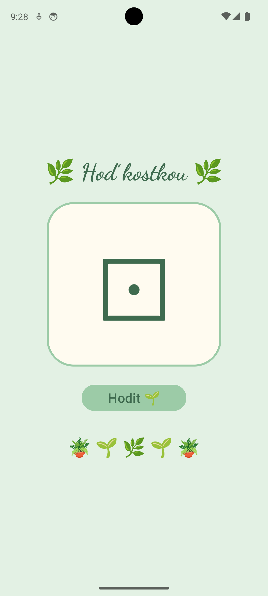
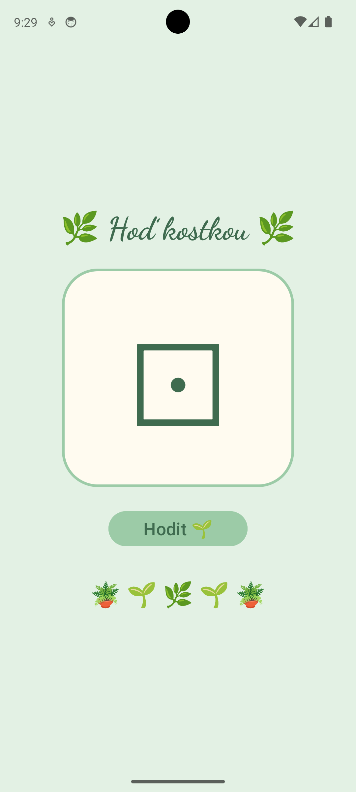

# Hoď kostkou – XML vs. Jetpack Compose

Dvě Android aplikace se stejnou funkcí: nadpis „Hoď kostkou“, velký symbol kostky a tlačítko „Hodit“. Po kliknutí se kostka 10× náhodně změní s prodlevou 250 ms a poté zůstane zobrazen výsledný hod. Během animace je tlačítko zakázané. Obsah je vystředěný a nezasahuje pod systémové lišty.

Vzhled aplikací je laděný do pastelově zelené „plantové“ estetiky. Kostka se navíc při hodu plynule otáčí.

## Struktura repozitáře

```
github-mh-pma-2026/
├── DiceXml/        – XML + Kotlin (Empty Views Activity, findViewById)
├── DiceCompose/    – Jetpack Compose (Empty Activity)
├── screenshots/
│   ├── dice_xml.png
│   └── dice_compose.png
└── README.md
```

## Screenshoty

| XML + Kotlin | Jetpack Compose |
|---|---|
|  |  |

## Jak každá varianta aktualizuje zobrazenou kostku

### XML + Kotlin (imperativní přístup)

Rozhraní je popsané v souboru `activity_main.xml` (`llMain`, `tvTitle`, `tvDice`, `btnRoll`). V Kotlinu si pomocí `findViewById` získáme odkazy na `TextView` a `Button`. Při každém kroku animace **ručně přepíšeme text** kostky:

```kotlin
tvDice.text = diceSymbols.random()
```

Stejně ručně zakazujeme a povolujeme tlačítko (`btnRoll.isEnabled = false / true`). Prodlevu 250 ms zajišťuje `Handler.postDelayed`, kroky animace se řetězí rekurzivní funkcí `showRandomSymbol`. Programátor sám odpovídá za to, aby zobrazení odpovídalo stavu aplikace. Odsazení od systémových lišt řeší `setOnApplyWindowInsetsListener` s voláním `setPadding`.

### Jetpack Compose (deklarativní přístup)

Rozhraní je popsané funkcí `@Composable` `DiceScreen()`. Aktuální symbol a informace o probíhajícím hodu jsou uložené ve **stavových proměnných**:

```kotlin
var diceSymbol by remember { mutableStateOf(diceSymbols.first()) }
var isRolling by remember { mutableStateOf(false) }
```

Na prvky nesaháme přímo. Stačí změnit stav (`diceSymbol = diceSymbols.random()`) a Compose automaticky provede **rekompozici**, takže překreslí ty části UI, které na stavu závisí. Tlačítko má `enabled = !isRolling`, takže se zakazuje samo podle stavu. Animace je jedna coroutine (`scope.launch`) s `repeat(10)` a `delay(250)`. Odsazení od lišt zajišťuje modifikátor `systemBarsPadding()`.

## Vylepšení aplikace

### 1. Animace otočení kostky

Při hodu se kostka třikrát otočí (1080°) a ke konci zpomalí. Animace trvá 2500 ms, tedy stejně dlouho jako 10 kroků po 250 ms.

**XML:** animace se spouští příkazem přímo na konkrétním prvku.

```kotlin
tvDice.animate()
    .rotationBy(1080f)
    .setDuration(2500)
    .setInterpolator(DecelerateInterpolator())
    .start()
```

**Compose:** úhel otočení je stavová hodnota (`Animatable`), kterou modifikátor `graphicsLayer` jen čte. Animace běží ve vlastní coroutine souběžně se střídáním symbolů.

```kotlin
val rotation = remember { Animatable(0f) }
// ...
Text(
    text = diceSymbol,
    modifier = Modifier.graphicsLayer { rotationZ = rotation.value }
)
// ...
launch {
    rotation.snapTo(0f)
    rotation.animateTo(1080f, tween(2500, easing = LinearOutSlowInEasing))
}
```

Aby se otáčející se symbol neořezával, má v obou variantách kolem sebe rezervu (padding).

## Porovnání

| | XML + Kotlin | Jetpack Compose |
|---|---|---|
| Definice UI | XML soubor | Kotlin funkce (`@Composable`) |
| Přístup k prvkům | `findViewById` | není potřeba |
| Změna zobrazené kostky | ruční `tvDice.text = ...` | změna stavu → automatická rekompozice |
| Zakázání tlačítka | ruční `btnRoll.isEnabled = ...` | `enabled = !isRolling` |
| Časování animace | `Handler.postDelayed` + rekurze | coroutine, `repeat` + `delay` |
| Odsazení od lišt | listener + `setPadding` | `Modifier.systemBarsPadding()` |
| Otočení kostky | `tvDice.animate().rotationBy(...)` – příkaz na prvku | `Animatable` + `graphicsLayer` – úhel je stav, UI ho čte |
| Barvy | `res/values/colors.xml` | Kotlin konstanty typu `Color` |
| Tvary a styl | `drawable` (shape), atributy na prvcích | modifikátory (`background`, `border`), parametry funkcí |

## Shrnutí

U XML varianty říkáme, **jak** se má UI změnit (najdi prvek, přepiš jeho text, spusť animaci na prvku). U Compose popisujeme, **jak má UI vypadat pro daný stav**, a o překreslení se postará framework. Compose kód je kratší a méně náchylný na nekonzistenci mezi stavem a zobrazením, XML varianta je zase přímočařejší pro pochopení základů Androidu.